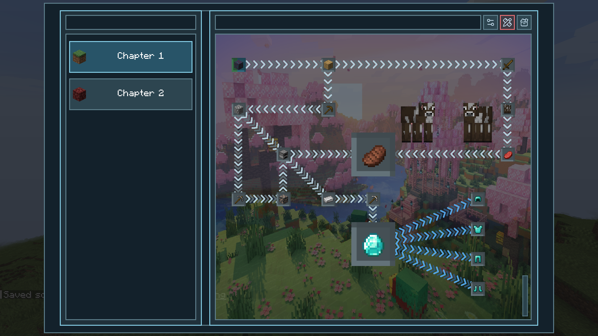
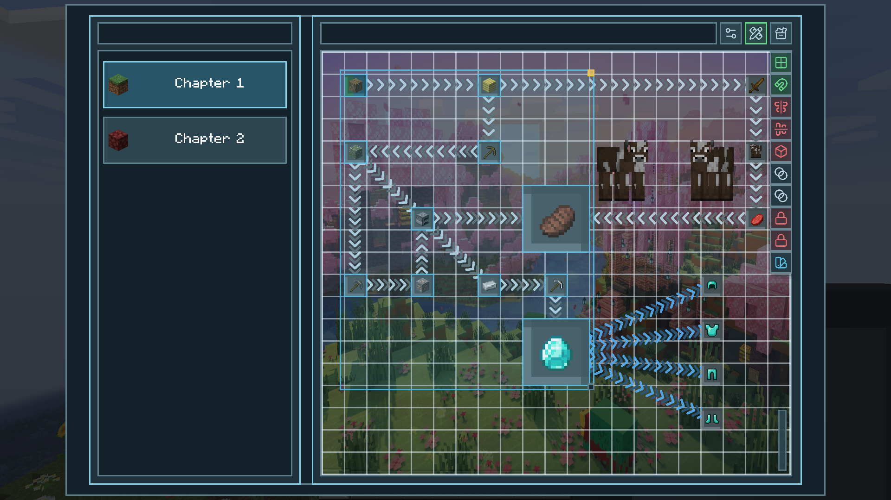
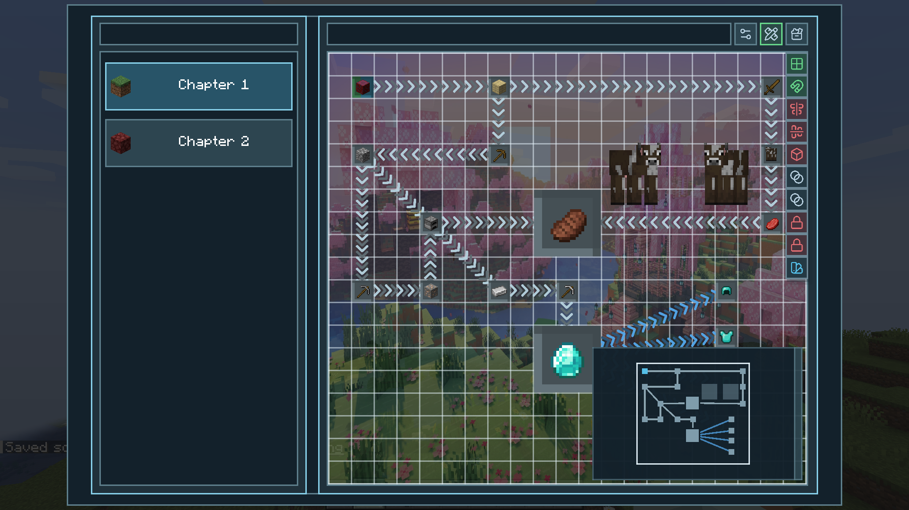
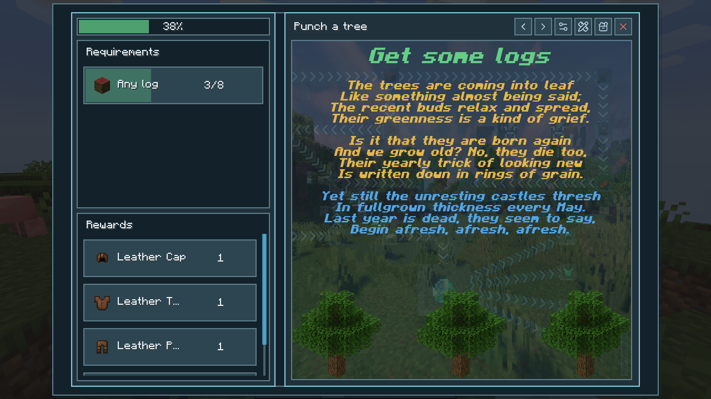
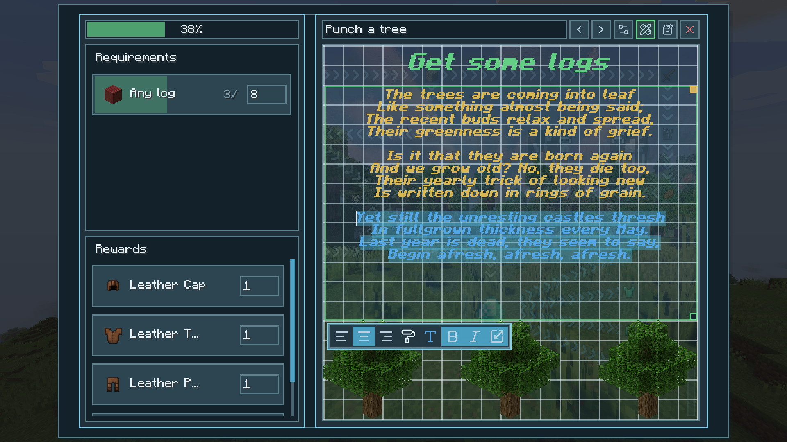
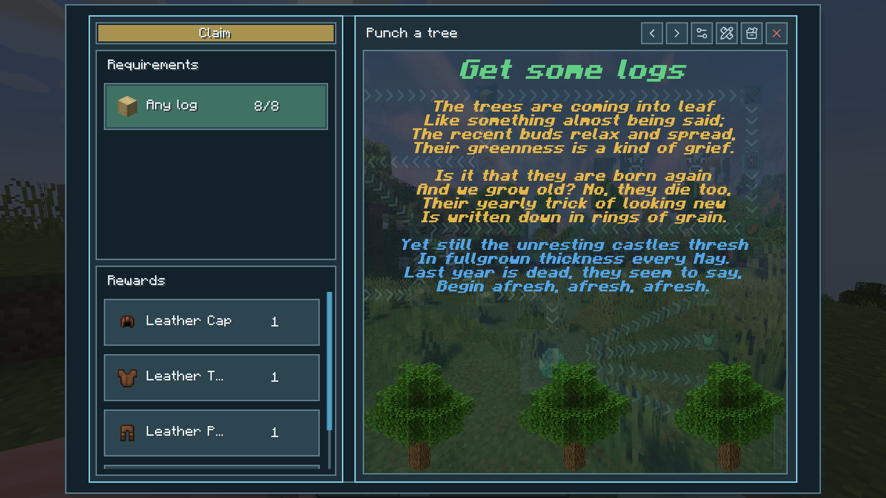

# Quests and Stuff

Quests and Stuff is a questing mod that I originally created for private use, but I eventually wanted something I could use in a modpack that I plan to publish someday (I’m lying, I’ll probably never finish making it). The existing questing mods either don’t have the features I want or use restrictive licenses that won’t allow me to publish my modpack outside specific platforms, so I made my own.

### Main Canvas

### Quest Details

## Features

- Forge and Fabric support
- In-game visual editor
- Straight or grid-style connection lines
- Custom connection colors
- Item, XP, advancement, recipe, stat, biome, dimension visit, structure visit, manual check , Block interaction, entity interaction, item interaction, item use, and entity kill requirements
- Item, XP, command, loot table, and selectable rewards
- Command rewards can be disabled in config
- Inventory/NBT picking for item rewards
- Repeatable quests
- Custom quest icons
- Custom chapter icons
- Custom quest details backgrounds
- Custom chapter card backgrounds
- Custom chapter canvas backgrounds
- Custom completion sounds
- Quest completion HUD
- Add text, images, and entity previews on the canvas next to quests
- Copy, paste, undo, and redo
- Grid, snapping, center guides, and other editor tools
- Minimap for large quest maps
- Custom UI themes

## WIP

- Full coordinate/radius UI for location requirements
- custom quest card backgrounds
- custom quest card shapes
- more customizable quest completion HUD

## TODO

- write docs and record some tutorial videos
- Blueprint system for reusable quest layouts
- Import and export for quest packs

## SOME NOTES

- My mods and texture packs are officially published **only** on Modrinth. Since this mod is licensed under the MIT License, you may also see reuploads elsewhere, so please download only from sources you trust and be careful with random files.

- An AI coding agent was used while making this mod. If that bothers you, that is completely fine use it, avoid it, fork it, or ignore it or simply do what you want.
