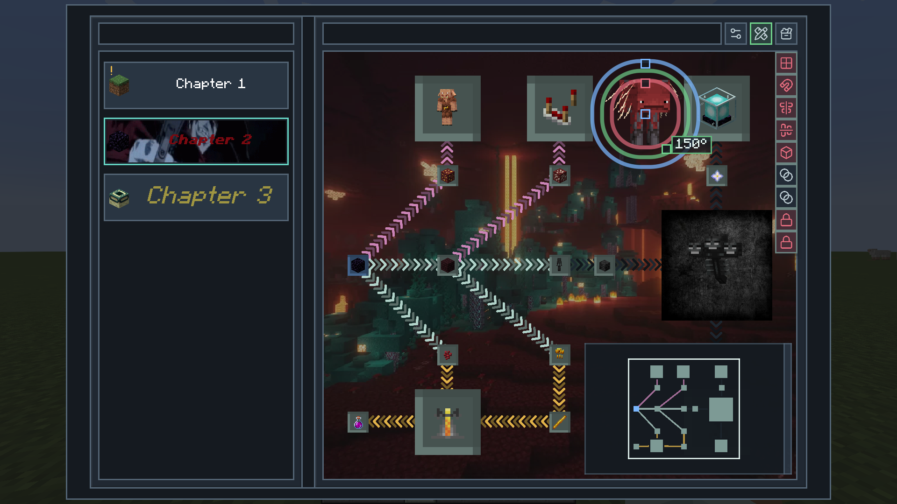
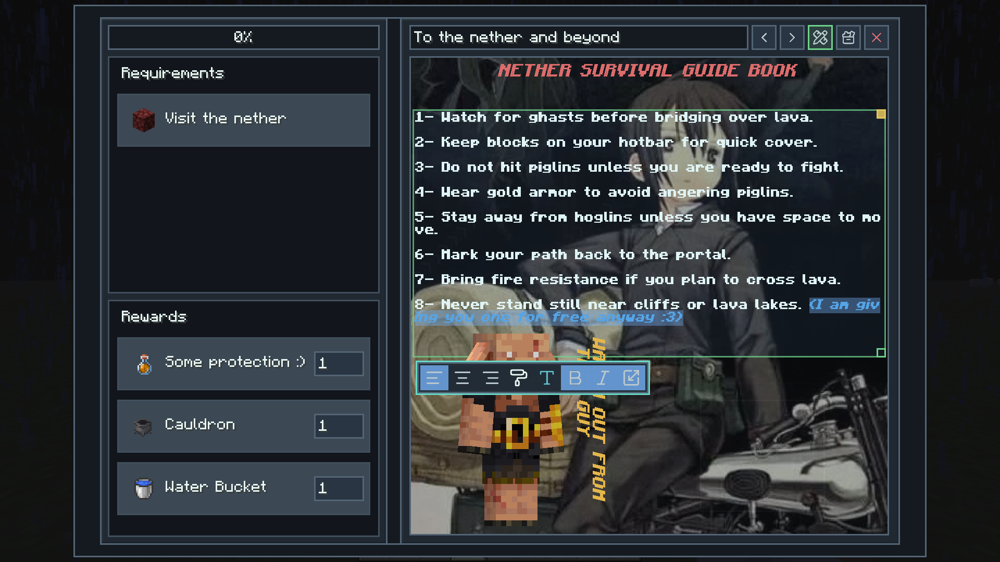

# Quests and Stuff

Quests and Stuff is a questing mod that I originally created for private use, but I eventually wanted something I could use in a modpack that I plan to publish someday (I’m lying, I’ll probably never finish making it). The existing questing mods either don’t have the features I want or use restrictive licenses that won’t allow me to publish my modpack outside specific platforms, so I made my own.

## Screenshots

### Main Canvas

### Quest Details

## Apps

### Quest Editor
The core app for creating and completing quests.
- Full in-game visual editor (no need to deal with scripts)
- Canvas blueprints — save, export, and import layouts through shareable codes
- 16+ task types and 5 reward types
- Repeatable, lockable, and hideable quests and chapters
- Exclusive Choice branching for quest lines
- Custom icons, backgrounds, connection styles, and completion sounds
- The ability to add text, images, items, blocks, and entity previews to the canvas
- Quest minimap to make navigating big quest lines easier
- Copy, paste, undo, and redo and all kind of interactions to make things easier
- Pinned quest HUD for tracking progress without opening the tablet, with layout editor and per-quest completion backgrounds textures
- Dedicated keybinds for nearly everything

### Teams
Group up with other players to share quest progress.
- Share quest progress with your team
- Share claimed chunks with your team

### Chunk Claimer
Claim and protect your territory.
- Claim chunks to protect against explosions and mob griefing
- Force loading for claimed chunks

### Settings
Customize your experience in one place.
- Theme picker with pre-defined themes
- Canvas display options (minimap, full screen, notifications)
- HUD layout editor and completion HUD settings
- Animation toggles per feature
- Chunk claim protection settings

## Integrations

- Optional JEI, EMI, and REI support for recipe keybinds and canvas recipe cards

## Dependencies

- Forge: LDLib 1.0.50
- Fabric: Fabric API and LDLib 1.0.50
- Optional: JEI, EMI, or REI for recipe keybinds and canvas recipe cards

## TODO

- write docs and record some tutorial videos

## SOME NOTES

- My mods and texture packs are officially published **only** on Modrinth. Since this mod is licensed under the MIT License, you may also see reuploads elsewhere, so please download only from sources you trust and be careful with random files.

- An AI coding agent was used during development. Just putting it out there for transparency. If that bothers you, that is completely fine use it, avoid it, ignore it or simply do what you want with it. It is up to you.

## License

Spoiler

MIT License

Copyright (c) 2025 ABO47

Permission is hereby granted, free of charge, to any person obtaining a copy
of this software and associated documentation files (the "Software"), to deal
in the Software without restriction, including without limitation the rights
to use, copy, modify, merge, publish, distribute, sublicense, and/or sell
copies of the Software, and to permit persons to whom the Software is
furnished to do so, subject to the following conditions:

The above copyright notice and this permission notice shall be included in all
copies or substantial portions of the Software.

THE SOFTWARE IS PROVIDED "AS IS", WITHOUT WARRANTY OF ANY KIND, EXPRESS OR
IMPLIED, INCLUDING BUT NOT LIMITED TO THE WARRANTIES OF MERCHANTABILITY,
FITNESS FOR A PARTICULAR PURPOSE AND NONINFRINGEMENT. IN NO EVENT SHALL THE
AUTHORS OR COPYRIGHT HOLDERS BE LIABLE FOR ANY CLAIM, DAMAGES OR OTHER
LIABILITY, WHETHER IN AN ACTION OF CONTRACT, TORT OR OTHERWISE, ARISING FROM,
OUT OF OR IN CONNECTION WITH THE SOFTWARE OR THE USE OR OTHER DEALINGS IN THE
SOFTWARE.

## THIRD PARTY LICENSES

Spoiler

Copyright (c) 2026 Lucide Icons and Contributors

Permission to use, copy, modify, and/or distribute this software for any purpose with or without fee is hereby granted, provided that the above copyright notice and this permission notice appear in all copies.

THE SOFTWARE IS PROVIDED "AS IS" AND THE AUTHOR DISCLAIMS ALL WARRANTIES WITH REGARD TO THIS SOFTWARE INCLUDING ALL IMPLIED WARRANTIES OF MERCHANTABILITY AND FITNESS. IN NO EVENT SHALL THE AUTHOR BE LIABLE FOR ANY SPECIAL, DIRECT, INDIRECT, OR CONSEQUENTIAL DAMAGES OR ANY DAMAGES WHATSOEVER RESULTING FROM LOSS OF USE, DATA OR PROFITS, WHETHER IN AN ACTION OF CONTRACT, NEGLIGENCE OR OTHER TORTIOUS ACTION, ARISING OUT OF OR IN CONNECTION WITH THE USE OR PERFORMANCE OF THIS SOFTWARE.

